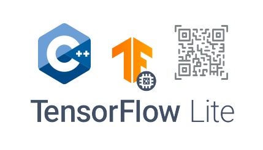

  

<h1 align="center">
  QR-Stego-TFLite-C++
</h1>

## QR-Stego-TFLite-C++ &middot;      ##

This repository contains code that runs pre-trained artificial neural network models in the `TensorFlow` framework in `Python` that have been converted to `TFLite` models using the `TFLite C++ API`.

## :computer: Getting Started  ##

**Building**

1. Install `TFLite` for `C++`.

2. Go to home directory and clone repository from github: `cd ~ && git clone https://SergeyIvanovDevelop@github.com/SergeyIvanovDevelop/QR-stego-C_plus_plus_tensorflowlite`

3. Change to the project directory: `cd QR-stego-C_plus_plus_tensorflowlite`

4. Run command to build the project: `make`

**Data embedding** 

5. Run command: `./encoder` 

When the file `./encoder` is launched, the image `My_QR.png` is embedded into the image `input_img.png` using neural steganography, which the artificial neural network `encoder_model.tflite` is trained to perform. The result of the program will be the image `output_img.jpg` containing the image `My_QR.png`.

**Data extraction** 

6. Run command: `./decoder` 

When the file `./decoder` is launched, the image `My_QR.png` is extracted from the image `output_img.jpg` into the image `Extract_QR.png` using neural steganography, which the artificial neural network `reveal_model.tflite` is trained to perform.

### :bookmark_tabs: Licence ###
QR-Stego-TFLite-C++ is [CC BY-NC-SA 3.0 licensed](./LICENSE).
